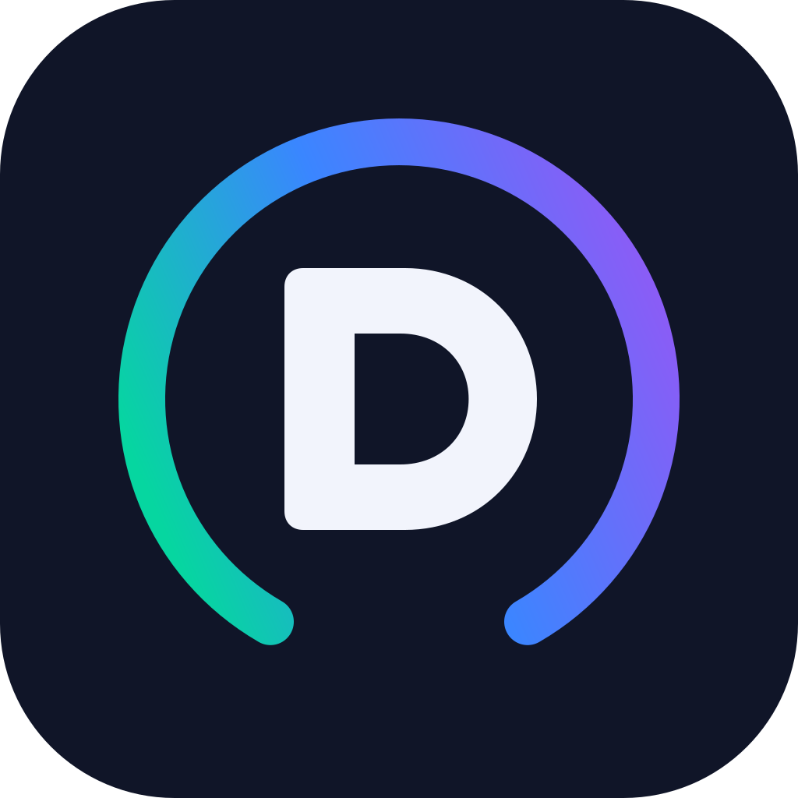

<p align="center">
  
</p>

<h1 align="center">Dashboarr</h1>

<p align="center">
  A mobile app to manage your self-hosted media stack from a single interface.
  <br />
  Built with Expo &amp; React Native. Inspired by nzb360.
</p>

<p align="center">
  
  
  
  
  
</p>

---

## What is Dashboarr?

Dashboarr is a native mobile app (Android & iOS) that connects directly to your self-hosted *arr stack and media services. No backend server required — the app talks to each service's REST API using your API keys.

**Supported services:**

| Service | What you can do |
|---|---|
| **qBittorrent** | View queue, pause/resume/delete torrents, speed stats, transfer progress |
| **Radarr** | Search & add movies, monitor status, view queue, missing/wanted lists |
| **Sonarr** | Search & add shows, episode monitoring, airing calendar/schedule |
| **Overseerr** | Browse & search media, request movies/shows, approve/decline requests |
| **Tautulli** | Active Plex streams, bandwidth stats, playback history |
| **Prowlarr** | Indexer status & toggle, search across all indexers, grab releases, stats |
| **Plex** | Now playing, recently added, on deck, library browsing |
| **Glances** | Server CPU, RAM, disk, and network stats |

## Features

- **Unified dashboard** — All your services at a glance with customizable, reorderable cards
- **Dark mode only** — Designed for OLED screens and late-night browsing
- **Auto network switching** — Detects your home WiFi SSID and switches between local/remote URLs automatically
- **Per-service configuration** — Enable only the services you use; tabs auto-hide for disabled services
- **Secure storage** — API keys stored in the device's secure enclave via `expo-secure-store`
- **Pull-to-refresh** — On every screen
- **Config import/export** — Back up and restore your entire configuration (with biometric auth)
- **No backend required** — Pure client architecture for core functionality; your data stays between your phone and your servers
- **Optional self-hosted backend** — Enable real push notifications by running the companion backend on your server (Node.js or Docker)

## Download from Play Store (Android)

Dashboarr is available on the Google Play Store as an open testing release:

1. **Join the Google Group:** [Dashboarr Testers](https://groups.google.com/g/dashboarr-testers)
2. **Opt in to the testing program:** [Web sign-up](https://play.google.com/apps/testing/com.dashboarr.app)
3. **Install from the Play Store:** [Dashboarr on Google Play](https://play.google.com/store/apps/details?id=com.dashboarr.app)

> **Note:** You must join the Google Group first, then opt in via the web sign-up link. After that, the Play Store listing will be available.

## Getting Started

### Prerequisites

- [Node.js](https://nodejs.org/) (v18+)
- [Expo CLI](https://docs.expo.dev/get-started/installation/)
- Android device/emulator or iOS device/simulator

### Installation

```bash
# Clone the repo
git clone https://github.com/renzobeux/dashboarr.git
cd dashboarr

# Install dependencies
npm install

# Start the dev server
npx expo start
```

Scan the QR code with [Expo Go](https://expo.dev/go) on your device, or press `a` for Android emulator / `i` for iOS simulator.

### Building for Production

```bash
# Android (EAS Build)
npm run build:android

# iOS (EAS Build)
npm run build:ios

# Android local production build
npm run build:android:prod
```

## Backend (Optional — Push Notifications)

Dashboarr works fully without a backend, but if you want **real push notifications** (torrent completed, new episodes grabbed, request approved, etc.), you can self-host the companion backend.

The backend is a lightweight Fastify + SQLite server that:
- **Polls** your *arr services on a schedule and detects state changes
- **Receives webhooks** from Radarr, Sonarr, Overseerr, Bazarr, and Tautulli
- **Sends push notifications** to your phone via the Expo push service
- **Pairs** with your device via QR code — no accounts needed

### Quick Start (Docker)

```yaml
# docker-compose.yml
services:
  dashboarr-backend:
    build: ./backend/dashboarr-backend
    # or use a pre-built image:
    # image: ghcr.io/renzobeux/dashboarr-backend:latest
    container_name: dashboarr-backend
    restart: unless-stopped
    ports:
      - "4000:4000"
    volumes:
      - dashboarr-data:/data
    environment:
      - NODE_ENV=production
      # - PUBLIC_URL=https://dashboarr.yourdomain.com  # set to embed URL in pairing QR for single-scan setup
      # - TRUST_PROXY=true                           # enable if behind a reverse proxy
      # - LOG_LEVEL=debug                            # default: info

volumes:
  dashboarr-data:
```

```bash
docker compose up -d
```

### Quick Start (Node.js)

```bash
cd backend/dashboarr-backend
npm install
npm run build
npm start
```

Then open the Dashboarr app, go to **Settings → Backend**, enter your backend URL, and scan the pairing QR code.

For full setup instructions, environment variables, webhook configuration, and more, see the [backend README](backend/dashboarr-backend/README.md).

## Configuration

All service configuration is done in the **Settings** tab within the app:

1. Enable the services you use
2. Enter each service's **local URL**, **remote URL**, and **API key**
3. Optionally set your **home WiFi SSID** for automatic local/remote URL switching
4. Reorder dashboard cards by entering edit mode on the dashboard

## Project Structure

```
app/                  # Expo Router file-based routing
  (tabs)/             # Bottom tab screens (dashboard, movies, tv, etc.)
  movie/              # Movie detail & search screens
  series/             # Series detail & search screens
  torrent/            # Torrent detail screen
backend/
  dashboarr-backend/  # Self-hosted companion server (Fastify + SQLite)
components/
  ui/                 # Reusable UI primitives (cards, buttons, inputs, toggles)
  dashboard/          # Dashboard card components
  common/             # Shared layout components (screen wrapper, pull-to-refresh)
  overseerr/          # Overseerr-specific components
services/             # Raw API clients for each service
hooks/                # TanStack Query wrappers (caching, polling, mutations)
store/                # Zustand stores + AsyncStorage/SecureStore helpers
lib/                  # Types, utils, constants, HTTP client
```

## Tech Stack

| Layer | Technology |
|---|---|
| Framework | Expo SDK 54 (React Native 0.81) |
| Routing | Expo Router v6 |
| Styling | NativeWind v4 (Tailwind CSS) |
| Data fetching | TanStack Query v5 |
| State management | Zustand v5 |
| Secure storage | expo-secure-store |
| Icons | lucide-react-native |
| Language | TypeScript (strict mode) |

## Roadmap

- [ ] iOS App Store publish
- [ ] SABnzbd integration
- [ ] Improve dashboard UI

## Contributing

Contributions are welcome! Feel free to open issues and pull requests.

1. Fork the repository
2. Create your feature branch (`git checkout -b feature/amazing-feature`)
3. Commit your changes (`git commit -m 'Add amazing feature'`)
4. Push to the branch (`git push origin feature/amazing-feature`)
5. Open a Pull Request

## License

This project is open source. See the [LICENSE](LICENSE) file for details.

## Acknowledgments

- [nzb360](https://nzb360.com/) — The original inspiration for this project
- The *arr stack community for building incredible self-hosted media tools
